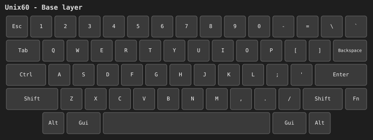
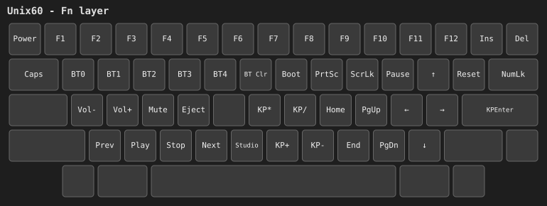

# Unix60

ZMK shield for the [FR4Boards Unix60](https://github.com/mkdl/Unix60), a 60%
HHKB-layout PCB that takes a Pro Micro footprint controller.

The shield name is `unix60` — that is what you pass as `-DSHIELD=unix60`, and it
matches this directory and every filename in it. It ships in the
`zmk-keyboard-unix60` module ([repo](https://github.com/drakche/zmk-config-unix60)),
which you can add to another config's `west.yml` rather than cloning; see the
[repo README](../../../README.md#using-this-from-your-own-config).

## Building

Firmware is built by GitHub Actions on every push (see `build.yaml`); there is
no local Zephyr toolchain in this repo.

1. Open the **Actions** tab of this repository and pick the workflow run for
   the commit you want (or the latest run on `main`).
2. Once it finishes, download the `firmware` artifact from the run summary
   and unzip it. It contains two files:
   - `unix60-nice_nano_v2-zmk.uf2` — the plain firmware (`build.yaml`'s
     `unix60` entry).
   - `unix60_studio.uf2` — the same firmware plus [ZMK
     Studio](https://zmk.dev/docs/features/studio) support (`build.yaml`'s
     `unix60_studio` entry, named via its `artifact-name`), which lets you
     remap keys at runtime without recompiling. Flash this one if you want to
     use Studio; otherwise the plain build is smaller and simpler.
   - `unix60_row2col.uf2` — a **diagnostic** build only. See "Reversed
     diodes" below. Do not flash this unless the plain build scans no keys
     at all.
3. Put the controller into bootloader mode: double-tap its reset button. A
   drive named `NICENANO` will mount on your computer.
4. Drag the `.uf2` file you chose onto the `NICENANO` drive. It flashes and
   reboots automatically once the copy finishes.

### Key reference (Fn layer)

| Keys | Action |
| --- | --- |
| `Fn` + `Q`…`T` | Select Bluetooth profile 0-4 |
| `Fn` + `Y` | Clear the current Bluetooth profile |
| `Fn` + `U` | Enter the bootloader |
| `Fn` + `]` | Soft reset |
| `Fn` + `B` | Unlock ZMK Studio (only needed on the `unix60_studio` build) |

## Hardware

- 7 rows x 9 columns, `diode-direction = "col2row"`.
- The matrix is **serpentine**: positions fill `RC(0,0)` through `RC(6,8)` in
  visual reading order, disregarding physical rows. This is why the transform
  map in `unix60.overlay` does not look like a grid.

| | QMK pins | pro_micro pins |
| --- | --- | --- |
| rows | `D3 D2 D1 D0 D4 C6 D7` | `1 0 2 3 4 5 6` |
| cols | `E6 B4 B5 F4 F5 F6 F7 B1 B3` | `7 8 9 21 20 19 18 15 14` |

60 of the 63 matrix positions are used. The three spare ones are the PCB's
alternate-layout switch positions, left unmapped on purpose:

| Position | Alternate key |
| --- | --- |
| `RC(1,5)` | 2u backspace, instead of split `\` + `` ` `` |
| `RC(4,6)` | ISO `#` |
| `RC(5,0)` | split left shift / ISO backslash |

## Keymap

`unix60.keymap` defines two layers, named `Base` and `Fn` (the names ZMK
Studio shows). Both are ported 1:1 from `unix60.json` (the QMK Configurator
export in the repo root); the only additions are the Bluetooth, bootloader,
reset and Studio-unlock keys, which occupy slots the export left blank.

**Base layer:**



**Fn layer** (hold `Fn`, the bottom-right key on the Base layer):



The images are generated from the shield's own devicetree files (geometry
from `unix60-layouts.dtsi`, bindings from `unix60.keymap`), so they cannot
drift out of sync with the actual keymap. Regenerate them after editing the
keymap with:

```bash
python3 tools/render_keymap.py
```

## Physical layout

ZMK ships `layouts/common/60percent/hhkb.dtsi`, but that is the HHKB/*Tsangan*
variant: 2u backspace, unsplit right shift, seven-key bottom row. The Unix60 is
true HHKB, so `unix60-layouts.dtsi` defines its own layout, transcribed from
QMK's `LAYOUT_60_hhkb`.

## Reversed diodes (`unix60_row2col` build)

The Unix60 ships as a bare PCB, so the 63 diodes are hand-soldered. If they
were all installed backwards, **no key registers at all** — and nothing in the
firmware or CI can detect it, because the board is electrically consistent,
just inverted.

`snippets/unix60-row2col/` compensates in firmware rather than requiring 63
parts to be desoldered: it overrides the kscan node to
`diode-direction = "row2col"` and swaps the GPIO roles, so the rows drive and
the columns read. The pins are unchanged.

Only reach for it after ruling out the far more common causes of a totally
dead matrix — a controller with no header pins soldered on, one not fully
seated, or one mounted on the wrong side of the PCB (the controller belongs on
the **back**, opposite the switches). To confirm the diodes are actually
reversed, put a multimeter in **diode mode** (not continuity — the ~0.6 V drop
won't trigger a continuity beeper), remove the controller, hold a key down and
probe the two through-holes for that key's row and column pins. Conduction in
the opposite polarity to the schematic means they're reversed.

The snippet restates the pin lists in order to swap the flags, so the pins
exist in two places. `tools/validate_shield.py` asserts they never drift:
`check_row2col_snippet` requires the snippet's pins to equal the base
shield's exactly, in the same order, with only the flags and scan direction
inverted.

## Note for Pro Micro nRF52840 (SuperMini) controllers

These nice!nano clones have a battery voltage divider that is silkscreened
`P0.04` but actually wired to `P0.24`
([reverse-engineering](https://github.com/sasodoma/nrf52840-promicro)). `P0.24`
has no ADC channel, so the divider is useless — but ZMK never reads it, because
`nice_nano_v2` measures the battery through the SoC's internal `VDDH` sensing.
Battery reporting works.

The catch: `P0.24` is `pro_micro` pin 5, which the Unix60 hardwires to matrix
row 5 — the `Z X C V B N M ,` row. The divider is high-impedance against the
nRF52840's internal pull-down, so this is expected to work. If you ever see
phantom or stuck keys **confined to that row**, the divider is the cause;
removing R10 on the controller fixes it at no cost.

## Provenance

- Matrix pins, diode direction and per-key matrix positions: QMK
  `keyboards/fr4/unix60/keyboard.json`, vendored byte-identical at the repo
  root as `unix60-keyboard.json`
  ([source](https://raw.githubusercontent.com/qmk/qmk_firmware/master/keyboards/fr4/unix60/keyboard.json),
  from the GPL-2.0-licensed
  [qmk_firmware](https://github.com/qmk/qmk_firmware) repository). The
  matrix-to-Pro-Micro-pin translation is the standard ATmega32U4 Pro Micro
  pinout, not project-specific.
- Keymap: `unix60.json` in the repo root, a QMK Configurator export for
  `LAYOUT_60_hhkb`.
- Run `python3 tools/validate_shield.py` from the repo root to check the
  shield files still agree with both sources. It derives the expected matrix
  map and physical-layout geometry directly from `unix60-keyboard.json` and
  compares them index-for-index against `unix60.overlay` and
  `unix60-layouts.dtsi` — a transposed matrix position or a drifted key
  coordinate fails the comparison even though it would otherwise look like a
  perfectly well-formed layout.
